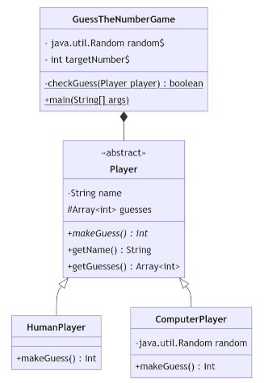

# Adivinhe o Número - Guess the Number

## Índice

- [1. Considerações Gerais](#1-considerações-gerais)
- [2. Prefácio](#2-prefácio)
- [3. Resumo do Projeto](#3-resumo-do-projeto)
- [4. Objetivos de Aprendizagem](#4-objetivos-de-aprendizado)
- [5. Considerações Gerais](#5-considerações-gerais)
- [6. Considerações Técnicas](#6-considerações-técnicas)
- [7. Recomendações](#7-recomendações)

---

## 1. Considerações Gerais

- Este projeto deve ser desenvolvido de manera **individual**.
- A estimativa de tempo para completar o projeto é de 1 a 2 Sprints.
- Concentre-se em adquirir conhecimento ao invés de
  simplemente "terminar" o projeto.
- Tenha paciência! Não se preocupe muito com o que você ainda não entende
  completamente.
- Seu aprendizado se desenvolverá à medida que você progrid.

## 2. Prefácio

Atualmente, Java é uma das linguagens de programação mais utilizadas no mundo.
Apesar da diversidade de plataformas e ferramentas disponíveis, é fundamental
ter uma base sólida nos conceitos fundamentais de Java e na programação
orientada a objetos (OOP). O objetivo deste projeto é te introduzir ao mundo do
Java por meio de um jogo simples e divertido.

## 3. Resumo do Projeto

É um jogo interativo que se realiza no terminal, no qual a
jogadora e o computador se alternam para tentar adivinhar um número
aleatório entre 1 e 100. Deve-se levar em consideração a tentativa anterior, se
foi "muito alta" ou "muito baixa".

## 4. Objetivos de Aprendizado

### Java & OOP

- [ ] **Tipos de dados: primitivos vs não primitivos**
- [ ] **Strings (cadeias de caracteres)**
- [ ] **Arrays (matrizes)**
- [ ] **_Access Modifiers_: `private`**
- [ ] **_Access Modifiers_: `protected`**
- [ ] **_Access Modifiers_: `public`**

- #### Programação Orientada a Objetos (OOP)

  - [ ] **Classes**
  - [ ] **Objetos**
  - [ ] **Métodos**
  - [ ] **Atributos**
  - [ ] **Construtores**
  - [ ] **Encapsulamento**
  - [ ] **Abstração**
  - [ ] **Composição**
  - [ ] **Interfaces**
  - [ ] **Herança: `super`**
  - [ ] **Herança: `extends`**
  - [ ] **Herança: `override`**
  - [ ] **Linguagem Unificada de Modelagem (UML): Diagramas de classes**

- [ ] **Variáveis**
- [ ] **Condicionais**
- [ ] **Uso de loops/ciclos (loops)**

- #### Coleções

  - [ ] **Listas: ArrayList**

- #### Testes

  - [ ] **JUnit**
  - [ ] **Mockito**

## 5. Considerações Gerais

- Duração do projeto: Estima-se que este projeto levará de 1 a 2 sprints.
- Deve ser implementado em Java. As únicas dependências externas que podem ser
  usadas são JUnit e Mockito para testes unitários.
- O jogo será realizado no terminal. Os testes podem ser executados no
  terminal ou em seu IDE (recomendamos usar
  [IntelliJ Community Edition](https://www.jetbrains.com/idea/download/))
- Será usado um número aleatório entre 1 e 100 como número secreto.
- A jogadora e o computador se alternarão para adivinhar o número.
- Após cada turno, informações sobre a suposição feita serão exibidas.
- O jogo terminará quando o número for adivinhado. A lista de
  todas as tentativas da jogadora vencedora deve ser exibida.

### Diagrama de Classes

#### `GuessTheNumberGame`

**Propósito:**
Lida com a lógica principal, decide qual jogador assume o próximo turno.

**Atributos estáticos (`static`):**

- `random`: Gerador de números aleatórios.
- `targetNumber`: Número aleatório entre 1 e 100 a ser adivinhado na partida
  atual.

**Métodos estáticos (`static`):**

- `main(String[] args)`: Inicia o jogo e gera o número aleatório.
- `checkGuess(Player player)`: Executa um turno, obtém a suposição e avalia
  o novo estado da partida.

#### `Player`

**Propósito:**
Representa uma jogadora genérica. É uma classe abstrata. Define os
atributos e métodos que todas as _classes_ de jogadoras devem compartilhar:

**Atributos:**

- `name`: O nome da jogadora.
- `guesses`: O histórico de suposições da jogadora.

**Métodos:**

- `makeGuess()`: Retorna a suposição da jogadora. É um método abstrato.
- `getName()`: Retorna o nome da jogadora.
- `getGuesses()`: Retorna o histórico de suposições da jogadora.

#### `HumanPlayer` e `ComputerPlayer` (herdam de `Player`)

**Propósito:**
Representa as jogadoras _Humana_ e _Computadora_, respectivamente.

**Métodos:**

- `makeGuess()`: Método que cada classe que herda de `Player` deve implementar.

**Relações:**

- A classe `GuessTheNumberGame` interage com as classes `HumanPlayer` e
  `ComputerPlayer` para gerenciar o jogo.
- Tanto a classe `HumanPlayer` quanto `Computer Player` são subclasses de
  `Player`, o que implica que herdam todas as suas propriedades e métodos, mas
  também têm algumas características adicionais próprias.

Este design de classes permite separar as responsabilidades, facilitando
a manutenção e possíveis extensões do jogo no futuro.

Por exemplo, poderíamos adicionar diferentes jogadoras "máquina" com diferentes
estratégias para a suposição automática, um novo tipo de jogadora "remota" ou
até mesmo diferentes níveis de dificuldade.

### **Critérios de Aceitação Mínimos do Projeto**

- A jogadora e o computador se alternarão em turnos para
  tentar adivinhar o número.
- Após cada tentativa, deve ser exibido:
  - O nome do jogador (pessoa ou computador).
  - A suposição feita.
  - Uma mensagem indicando se a suposição foi muito alta, muito baixa
    ou correta.
- O jogo terminará assim que a jogadora ou o computador adivinhar o
  número secreto. Deve ser exibida uma mensagem de fim de jogo, bem como uma lista
  de todas as tentativas feitas pela jogadora vencedora.

## 6. Considerações Técnicas

- O jogo será realizado no terminal usando Java.
- A lógica do jogo será baseada em estruturas de controle,
  incluindo loops, condicionais e coleções.
- Deve-se dividir o código e melhorar
  sua legibilidade e manutenção.
- Deve-se usar uma funcionalidade da biblioteca de utilitários do Java para
  geração de números aleatórios.
- Devem ser realizados **testes unitários** para suas classes e métodos usando
  JUnit e simulação de geração de números aleatórios com Mockito.

## 7. Recomendações

**Documentação do Java**: A documentação oficial do Java é uma excelente
fonte de informações sobre as classes e métodos disponíveis em Java
(recomendamos usar o Java 20).

**Projete a Estrutura do Jogo**: Antes de começar a escrever código,
considere como deseja que o jogo funcione. Pense em como alternar
os turnos entre a jogadora e a computadora, como gerar e avaliar
as suposições e como mostrar informações ao jogador. Pare um momento
para analisar e projetar sua solução antes de começar a implementá-la.

**Separação de Responsabilidades**: Recomendamos seguir o diagrama de
classes fornecido para obter uma clara separação da lógica do jogo em
componentes ou classes que permitam manter o código organizado e legível.

**Você Precisará de Loops e Condicionais**: Loops e declarações condicionais
serão seus aliados neste projeto para controlar os turnos, avaliar as
suposições e determinar o vencedor.

**Manipulação de Números Aleatórios**: Use a classe `Random` de `java.util` para
gerar o número aleatório secreto. Você pode encontrar informações sobre como
usá-la na documentação do Java.

**Testes Unitários**: À medida que desenvolve o jogo, tente escrever
testes unitários para verificar se as diferentes partes do jogo funcionam
como o esperado. Você pode usar o framework JUnit para escrever seus testes.

Lembre-se de que este projeto foi projetado para que você possa aplicar seu
conhecimento prévio em JavaScript, "traduzindo-o" para Java,
aprendendo o paradigma de programação orientada a objetos no processo.

**_Divirta-se construindo seu jogo de adivinhação de números! 🎲🎮_**
